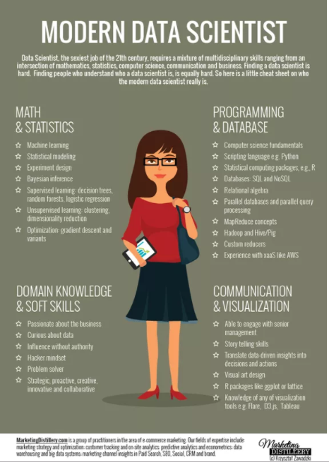

***
### Agenda 

+ Canales de comunicación
+ Temario
+ Evaluación
+ Reglas del juego
+ Bibliografía
+ Business Intelligence, minería de datos, ingeniería de datos, machine learning, ciencia de datos

***

### Canales de comunicación

+ **Slack: md-itam-agodic17**, necesitan enviarme un correo a liliana.millan@gmail.com $\rightarrow$ por favor agrega una imagen a tu slack para que sepa quién es quién! 
+ **Dropbox**, los agrego con el correo que me hayan enviado para sus accesos
+ **Github**, los agrego con el correo que me hayann enviado para sus accesos 
+ **Contenido:** [lilianamillan.com](https://www.lilianamillan.com/data_mining-1)

***
### Temario

+ Introducción a minería de datos: Business Intelligence, Data Science, Data Profiling, Data Mining 
+ R como herramienta de análisis, visualización y generación de reportes de negocio
    + ggplot
    + plotly
    + googleVis
+ ETL 
    + bash
    + grep, sed
    + cron
    + awk
+ Data Profiling
+ Data Mining
    + Métodos supervisados
      + Clasificadores
          + Árboles
          + Random Forest
          + Naive Bayes
          + Redes Neuronales
          + Métricas de desempeño de modelos 
            + TP, FP, TN, FN
            + ROC
            + Matriz de confusión
            + Accuracy, Precision, Recall, F-Score
      + Predictores 
          + Regresión lineal
          + Regresión logística
          + Series de tiempo
          + Métricas de desempeño del modelo
              + MSE, RMSE, MPE
  + Métodos no supervisados
      + Métodos de agrupación
          + Dendogramas
          + k-means
          + SOM-Kohonen
      + Métodos de asociación
          + Apriori
  + Information retrieval
      + TF/IDF
  + Produto de ciencia de datos
      
      

***

### Evaluación 

+ Tareas: 30%
+ Examen 1: 35%
+ Examen 2: 35%

*** 

### Reglas del juego

+ Las tareas se entregan en un reporte RMD generado con Markdown (lo vemos la siguiente semana), debes incluir el Rmd **y** el html generado
+ Las tareas se entregan en *git* hasta las 11:59:59 CST del día en el que hayamos quedado
+ Las tareas se entregan en el folder `alumnos/tareas/tema/nombre_apellido` 
+ Por cada día de retraso se baja 0.5 de calificación (en escala de 1-10)
+ Todas las dudas/preguntas las pueden hacer por slack y todos pueden colaborar en las respuestas
+ Ocupo un método de minería de texto para identificar similitud de textos por lo que es posible identificar si las tareas son copiadas $\rightarrow$ tareas muy similiares reparten calificación entre el número de tareas similares... por ejemplo: 3 tareas son muy similares y sacan 8, cada uno recibe 8/3 de calificación
+ Todos los exámenes son para llevar a casa, aplica misma regla que tareas con similitud de reportes
+ Además de ver el código con el que realizan sus tareas me interesa conocer sus opiniones y justificaciones para ejecutar/seleccionar un método sobre otro, o el análisis de los resultados $\rightarrow$ en el mundo real a los jefes no les interesa cómo lo hiciste, les interesan los resultados y el sustento matemático/estadístico/de negocio. 

 **No es mi responsabilidad hacer que jalen sus Rmd ... por favor verifica que al entregar tu Rmd corra sin problemas!**

***
### Bibliografía

+ [Data Science and Big Data Analytics](https://www.amazon.com.mx/Data-Science-Big-Analytics-Discovering-ebook/dp/B00RXHVQF6/ref=sr_1_13?ie=UTF8&qid=1484171194&sr=8-13&keywords=data+science+and+big+data+analytics)

+ [The Elements of Statistical Learning](https://www.amazon.com.mx/Elements-Statistical-Learning-Inference-Prediction/dp/0387848576/ref=sr_1_1?s=books&ie=UTF8&qid=1484171703&sr=1-1&keywords=the+elements+of+statistical+learning)

+ [Data Analysis with R](https://www.amazon.com.mx/Data-Analysis-R-Tony-Fischetti-ebook/dp/B019IOX4YW/ref=sr_1_1?ie=UTF8&qid=1484175707&sr=8-1&keywords=data+analysis+with+R)

+ [Data Science for Business](https://www.amazon.com.mx/Data-Science-Business-Foster-Provost/dp/1449361323/ref=sr_1_1?s=books&ie=UTF8&qid=1484171441&sr=1-1&keywords=data+science+for+business)

+ [Storytelling with Data](https://www.amazon.com/Storytelling-Data-Visualization-Business-Professionals-ebook/dp/B016DHQSM2/ref=sr_1_1?s=books&ie=UTF8&qid=1484176053&sr=1-1&keywords=data+storytelling)

+ [Information dashboard design: Displaying Data for At-a-Glance Monitoring](https://www.amazon.com/Information-Dashboard-Design-At--Glance/dp/1938377001/ref=asap_bc?ie=UTF8)

+ [Now you see it: Simple visualization techniques for quantitative analysis ](https://www.amazon.com/Now-You-See-Visualization-Quantitative/dp/0970601980/ref=asap_bc?ie=UTF8)

+ [Show me the numbers: Designing Tables and Graphs to Enlighten](https://www.amazon.com/Show-Me-Numbers-Designing-Enlighten/dp/0970601972/ref=asap_bc?ie=UTF8)

***

### Introducciones 

+ Tu nombre
+ ¿Qué carrera estas estudiando?
+ Semestre/cuántos te faltan
+ Trabajas? (en dónde, haciendo qué?)
+ ¿Por qué estas aquí?
    + ¿Qué esperas de esta clase?

*** 

### ¿Qué es: BI, minería de datos, ingeniería de datos, machine learning?

+ **Business Intelligence (BI)**

Dashboards o reportería asociada al comportamiento que ha tenido la compañía en el pasado utilizando los datos que genera la empresa. Contesta preguntas específicas realizadas por algun miembro gerencial, directivo o ejecutivo.  

+ **Minería de Datos**

Procesos aplicados a conjuntos de datos para obtener patrones e información que no hubiera podido ser adquirida o reconcida de manera obvia, la información generada se utiliza en estrategias del negocio.

+ **Ingeniería de Datos**

La "tubería" y tencología que se requiere para movilizar los datos de un lugar a otro y que puedan ser analizados (también ocupado en BI) 

+ **Machine Learning**

Técnicas y algoritmos de inteligencia artificial ocupados para encontrar patrones en conjuntos de datos.

### ¿Qué hace un: bi analyst, ingeniero de datos, ingeniero en machine learning?

+ **BI analyst**

Forma cubos de datos con los que puede obtener respuestas de preguntas específicas del negocio (del pasado), generalmente todo su output está asociado a un dashboard o reporte visual con las respuestas a la pregunta específica. Generalmente desarrolladores de software que se han metido más al análisis de datos realizado con herramientas comerciales que permiten visualizar datos: Tableau, QlickView, etc.

+ **Ingeniero de datos**

Conoce la tecnología requerida para hacer procesamiento en paralelo, distribuida, en la nube. Generalmente desarrolladores de software que se han especializado en tecnologías ocupadas para hacer análisis de datos: Hadoop, Spark, AWS, Bash, Docker. Pueden armar la infraestructura necesaria para poder extraer, transformar, cargar y guardar datos de diferentes fuentes. 

+ **Ingeniero en Machine Learning**

Conoce perfectamente todos los algoritmos que se ocupan en machine learning, está interesado en crear nuevos algoritmos de machine learning y/o optimizar algoritmos existentes para mejorar el desempeño del modelo y/o la calidad de la predicción.

### ¿Qué es Ciencia de Datos? 

Existen diferentes definiciones al respecto, pero podemos empezar por lo que NO es

+ No es una herramienta
+ No es una técnica
+ No es tecnología
+ No es BIG DATA (whatever does that means in your head right now!) (╯°□°)╯︵ ┻━┻
+ No es magia (ni negra ni blanca)
+ No es la solución a **cualquier** problema
+ No es Business Intelligence (╯°□°)╯︵ ┻━┻
+ No es estadística y ya
+ No es solo visualización
+ No es solo hacer modelos

 Cuando escuchas la palabra ciencia, ¿en qué piensas?

Entonces ¿qué si es Ciencia de Datos?

Iniciando solo con la palabra **Ciencia**, a diferencia de BI, en ciencia de datos se sigue un método científico para probar hipótesis. El objetivo es extraer conocimiento capitalizable de los datos de una empresa que le permitan mejorar sus estrategias y tomar decisiones —a cualquier nivel— respaldadas en la evidencia que sugieren los datos, no solo la intución, y la experiencia.

Ciencia de datos está compuesta por 3 grandes ramas con las que siempre trabajamos en conjunto. 

+ Estadística: Técnicas para dar robustes a los modelos que corremos en machine learning, sampleo, prueba de hipótesis, distribuciones, intervalos de confianza, estimaciodores, estadística bayesianda ...
+ Machine Learning: Algoritmos que nos permiten extraer patrones de los datos con base matemática y estadística
+ Ciencias computacionales: Lo que nos permite poner los modelos en producción, a obtener y limpiar datos, a hacer los modelos utilizables! (dan respuesta en menos de n segudos), hacerlos distribuidos, etc.

Tomada de (https://qph.ec.quoracdn.net/main-qimg-0ecc1f245ab94f3c946da945f712daf9?convert_to_webp=true)

+ **Data Mining** 

Procesos aplicados a datos para encontrar información/patrones que nos puedan ayudar a generar modelos de clasificación, predicción, agrupamiento o asociación.

*** 
### Tarea 

+ Instalar [R](https://cran.rstudio.com/) y [RStudio versión 3.3.2](https://www.rstudio.com/) versión desktop/free
+ Instalar [Git](https://git-scm.com/book/en/v1/Getting-Started-Installing-Git) (si es que no lo tienes instalado!)
+ Sacar una cuenta de github 
+ Enviarme correo con los siguientes datos: el correo con el que quieres que te agregue a slack y dropbox, tu usuario de github para agregarte al repo de la clase

