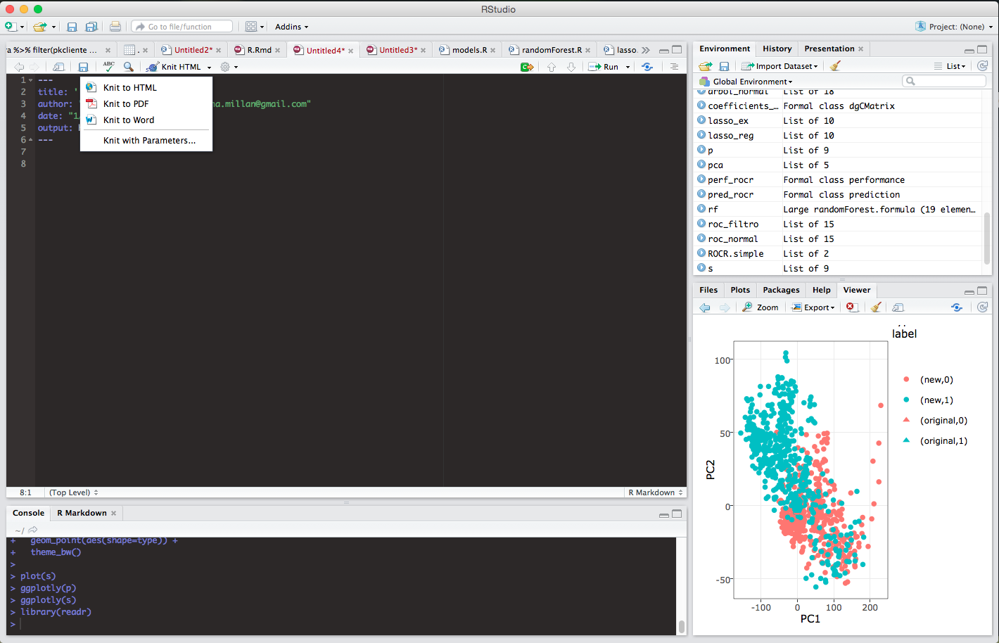
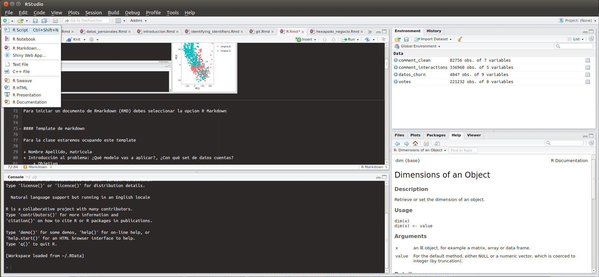
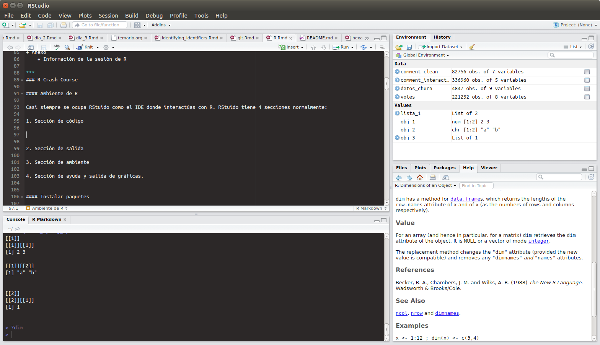
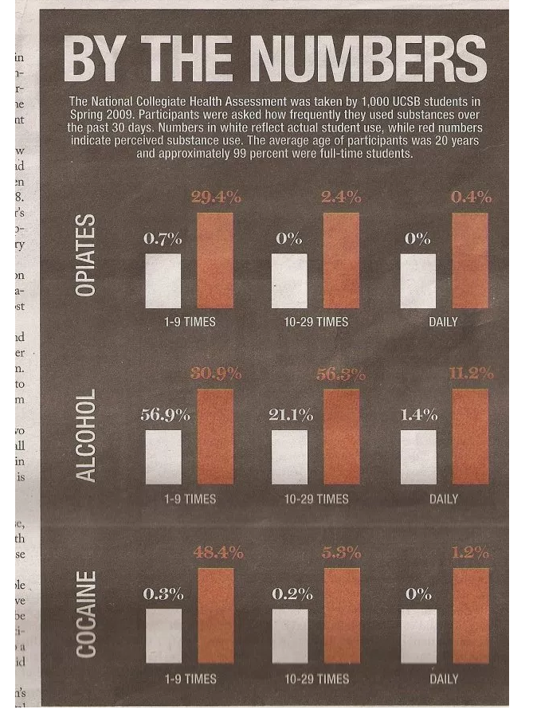
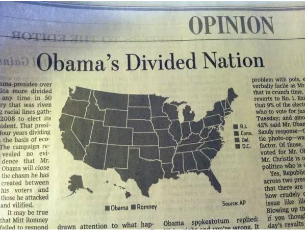
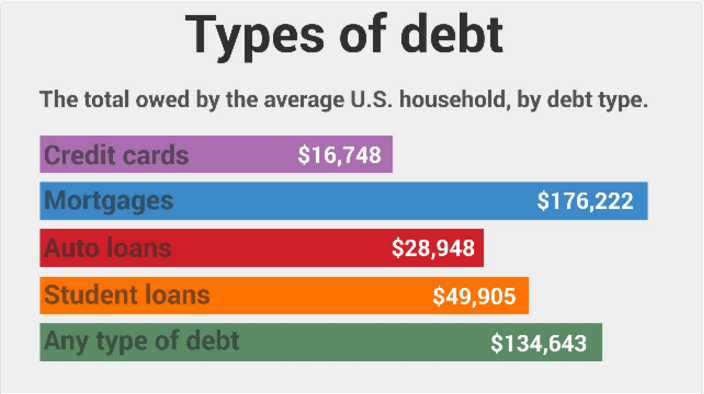
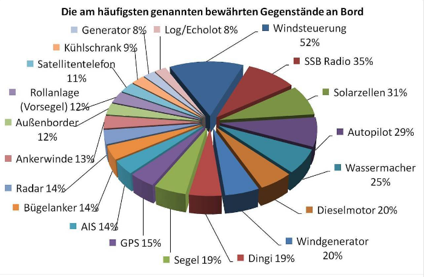

***

### Agenda

+ R
    + R diferencias con python
    + ¿Por qué R?
    + Shinyapps/shinydashboards
+ Markdown R
    + Template básico
+ R crash course
+ Visualización en R
    + ggplot
    + plotly
    + googleVis
+ Tutoriales
+ Referencias

*** 
### R

+ Lenguaje **estadístico** NO es de propósito general! 
+ Python es un lenguaje de propósito general, no deben ser comparados pues ambos tienen propósitos diferentes
+ Python tiene scikitlearn que es un módulo de machine learning que incluye varios de los modelos que R tiene en diversas librerías
+ Python tiene Django que es un framework para web aps, R tiene [Shinyapps](https://shiny.rstudio.com/) y [Shinydashboard](https://rstudio.github.io/shinydashboard/)
+ Fuera de estas dos comparaciones Python es lenguaje de propósito general, R es lenguaje estadístico! 

#### ¿Por qué R?

+ Utilizaremos R porque es open source —no tenemos que pagar una licencia por ocuparlo— 
+ Porque es el lenguaje por default que se ocupa en la industria seria de análisis de datos a.k.a. ciencia de datos (SAS es para empresas viejitas y muy acartonadas! y que tienen 10,000 USD para pagar la licencia!)
+ Porque nos da mucha facilidad en todos los modelos que hay implementados y nos permite tener visualizaciones muy cool
+ Porque nos permite generar dashboards sin tener que tener a un desarrollador que no nos quiera ayudar :( porque nunca tienen tiempo!
+ Porque nos permite hacer investigación reproducible y entregar reportes de negocio
+ Porque es un plus que vale mucho en sus CV
+ ...y ya la última, porque a mi me encanta :P

***

### Markdown 

Markdown es una extensión que viene en RStudio para generar reportes, estos reportes pueden ser creados en pdf o html (knit pdf o knit html respectivamente), también tiene opción para crear un documento en formato Word.... pero no hagan eso!!!!. 

Generalmente ocupamos el formato pdf cuando las visualizaciones que generamos en el código son estáticas (no necesitan que el usuario interactue con ellas para obtener información), el reporte se genera con [LateX](https://www.latex-project.org/) por lo que los fonts y en general la presentación por default es muy profesional. 

Si por otro lado necesitamos que las visualizaciones que estamos entregando sean interactivas entonces se ocupa el formato html. ESTE ES UN DOCUMENTO HECHO EN MARKDOWN :)

Markdown pemite que integremos texto normal con código de R con la opción de que el código puede o no ser mostrado en el reporte final, esto nos permite tener en un solo lugar tanto la explicación en 'humano' de lo que estamos haciendo como el código que ocupamos para generar los resultados. 

En esta clase estaremos ocupando markdowns para la entrega de **todas** las tareas (from now on ╭(◔ ◡ ◔)/)

[Markdown cheat sheet](https://github.com/adam-p/markdown-here/wiki/Markdown-Cheatsheet)

+ Agregar headlines `###`
+ Agregar links `[](path/for/image)`
+ Agregar imágenes ``
+ Agregar código R parámetros: echo, warning, error, message, fig.width, fig.height -> EJEMPLO <-
+ Ejemplo de reporte de negocio generado en un RMD de manera automática



Para iniciar un documento de Rmarkdown (RMD) debes seleccionar la opcion R Markdown



#### Template de markdown

Para la clase estaremos ocupando este template

+ Nombre Apellido, matrícula
+ Introducción al problema: ¿Qué modelo vas a aplicar?, ¿Con qué set de datos cuentas? 
    + Objetivo
+ Data Profiling
+ Modelo(s) a probar 
    + Justificación de la selección del modelo 
+ Resultados
+ Conclusiones
+ Recomendaciones al negocio
+ Anexo 
    + Información de la sesión de R

*** 
## R Crash Course

### Ambiente de R

Casi siempre se ocupa RStuido como el IDE donde interactúas con R. RStuido tiene 4 secciones normalmente: 

1. Sección de código: Donde escribes tu código (rmd, script, presentación). La esquina superior izquierda
2. Sección de salida: Donde al ejecutar el código de arriba (Ctrl+Enter o bien la flecha de Run) se muestra la salida obtenida (o el error asociado). La esquina inferior izquierda
3. Sección de ambiente: Donde puedes ir viendo las variables que estás creando y los valores que tienen. Esquina superior derecha
4. Sección de ayuda y salida de gráficas: Donde puedes ver las gráficas que generes, la ayuda aque solicites, los paquetes que tienes cargados y un explorador de directorios para cargar archivos directamente desde el ambiente de RStudio



### Instalar paquetes

`install.packages("nombrepaquete")`

Instalemos: ggplot2, scales, dplyr, lubridate, readr, plotly, googleVis, tidyr

Una vez que los paquetes son instalados para cargarlos en el ambiente de R y poderlos ocupar utilizamos `library(nombrepaquete)` $\rightarrow$ nota que en library no se ocupan las dobles comillas para llamar al paquete. 

 Para obtener ayuda en R puedes ocupar el signo de interrogación seguido del nombre de la función sobre la que tienes dudas `?dim` esto hará que sobre la esquina inferior derecha aparezca la información asociada al método del que pediste ayuda indicando:

+ Qué hace ese método -sección Description-
+ Cómo se usa -sección Usage-
+ Qué parámetros requiere -sección Arguments-
+ Qué devuelve -sección Value- 
+ Un ejemplo de uso -sección Examples-

### Asignación de variables

En R aunque existe el símbolo `=` la asignación **siempre** se realiza utilizando el símbolo `<-` que indica que lo que se encuentra a la derecha se asigna a lo que está a la izquierda. En cambio el símbolo  `=` se ocupa ÚNICAMENTE cuando estás generando columnas dentro de un data frame... lo veremos más adelante.

```{r echo=T}
texto_simple <- "Ejemplo asiganción de variables"
var_num <- 13

texto_simple
```

***
### Tipos de datos

+ **Booleans:** True/False

```{r echo=T}
var_bool_true <- T
var_bool_true_2 <- TRUE

class(var_bool_true)
var_bool_true
```

+ **Numéricos**

```{r echo=T}
var_num_1 <- 13 #numeric
var_num_1
var_num_2 <- 19.32 #numeric
var_num_2
var_num_3 <- 10i #complex
var_num_3

class(var_num_2)
```

+ **Character** 

```{r echo=T}
str_1 <- "ejemplo 1"
str_2 <- "ejemplo 2, con algo más"

str_1
```

+ **Factor** 

```{r echo=T}
fctr <- factor(c("a","b","c"))

fctr
```

+ **Niveles** 

```{r echo=T}
levels(fctr)
```

***
### Estructuras de Datos

#### **Vectores**

Son la base de la mayoría de las otras estructura de datos más complejas en R, se crean utilizando la función `c()` -concatenate-
    
```{r echo=T}
vector_1 <- c("uno","dos","tres")
vector_2 <- c(10,20,110)

vector_1
```

Para saber la longitud de un vector se ocupa la función *length()*

#### **Listas**

En R una lista es un vector con otros objetos adentro, y se tiene que poner explícitamente que se trata de una lista —list()—. 

```{r echo=T}
obj_1 <- c(2,3)
obj_2 <- c("a","b")
obj_3 <- list(1)

lista_1 <- list(obj_1, obj_2)
lista_1

obj_3
```

Para seleccionar cada objeto dentro de la lista, se ocupan dobles corchetes `[[]]`.

```{r echo=T}
lista_1[[1]]
```

#### **Matrices**

En R una matriz es una tabla, R tiene muchas operaciones optimizadas para poder realizar operaciones entre matrices, razón por la cuál es muy ocupada en análisis de datos :), nosotros normalmente no estaremos ocupando directamente matrices sino DataFrames una abstracción mucho más amigable y flexible.

Para definir una matriz ocupas la función `matrix()` indicando los datos, número de renglones, número de columnas y si debe acomodar los datos por renglón o por columna

```{r echo=T}
#matriz acomodando por renglon
a_matrix <- matrix(c(1:10),
                   nrow=2,
                   ncol=5,
                   byrow=T)
a_matrix

#matriz acomodando por columna
a_matriz <- matrix(c(1:10),
                   nrow=5,
                   ncol=2,
                   byrow=F)
```


#### **DataFrames**

Es por mucho la estructura de datos más utilizada en R, los data frames son tablas (como las de excel), formados por renglones y columnas (en ese orden!). Por default cuando creas un 

```{r echo=T}
df <- data.frame(a=vector_1, 
                 b=vector_2, stringsAsFactors = F)

df


df2 <- data.frame(color=c("rojo","verde","amarillo","negro"),
                 estatura=c(1.68, 1.54, 1.85, 1.90),
                 sexo=c("F","F","M","M"))

df2
```

Puedes saber la dimensión de un data frame -cuántos renglones y cuántas columnas- con la función dim `dim(nombre_df)`

```{r echo=T}
dim(df2)
```

Hay varias formas de interactuar con los dataFrames:

1. Utilizando los nombres de las columnas y/o renglones (la forma más sencilla). En esta formato ocuparás el símbolo de pesos `$` para extaer una columna o renglón (el renglón tiene que tener nombre!). Lamentablemente de esta forma solo puedes acceder a una columna a la vez... 

```{r echo=T}
df2$estatura
```
 

2. Utilizando el/los índices que quieres extraer. En este formato ocupas los indices de los elementos que quieres ver/extraer del dataFrame, recuerda que en R los índices inician en 1!

```{r echo=T}
#todos los renglones, ciertas columnas
df2[,2:3]

#ciertos renglones, todas las columnas
df2[2,]

#renglon especifico y columna especifica
df2[2,2]
```


3. Utilizando los nombres con dplyr, lo veremos más adelante

4. Otras posibles formas es utilizando los nombres de las columnas e índices al mismo tiempo (nota como se regresana en el orden indicado: primero sexo y luego estatura)
```{r echo=T}
df2[2,c("sexo","estatura")]
```

Para obtener los nombres de las columnas de un dataFrame puedes ocupar `names(df)`, esto te regresará en un vector el nombre de las columnas del dataFrame en el orden en el que se encuentran en el mismo

```{r echo=T}
names(df2)
```

Puedes cambiar los nombres de las columnas ocupando la misma función `names(df)` asignándole un nuevo vector con los nuevos nombres

```{r echo=T}
names(df2) <- c("color","sex","height")
df2
```

O puedes cambiar solo ciertos nombres indicando el índice de la columna a la que quieres cambiar el nombre.

```{r echo=T}
names(df2)[2] <- "sexo"
df2
```

 ¿Por qué aquí no hizo falta el `c()?`

Para saber de qué tipo es un objeto se ocupa la función `class(objeto)`

```{r echo=T}
class(df2)
```

Puedes hacer lo mismo con un vector dentro de un data frame 
```{r echo=T}
class(df2$color)
```

***
### Cargar datos en R 

Hay varias formas de cargar datos a R pero se tiene que tomar en cuenta el tamaño del data set. 
Siempre es mejor ocupar la librería **readr** de [Hadley Wickham](http://hadley.nz/) ;) (te presento a tu próximo nuevo ídolo!) 

Cargaremos un set de datos correspondiente a información de [cáncer de mama](https://www.kaggle.com/uciml/breast-cancer-wisconsin-data)

```{r echo=T}
suppressPackageStartupMessages(library(readr))

breast_cancer <- read_csv("~/Documents/itam/mineria_datos_licenciatura/data/breast_cancer.csv")
class(breast_cancer)
head(breast_cancer)
```

#### Operaciones básicas 

Generalmente todo en R es un data frame o algún sabor más optimizado de él: `tbl_df`, `tbl` o `tibble` que pueden cargar una mayor cantidad de datos de manera más eficiente que el mortal dataFrame -optimizaciones de Hadley Wickham- 

+ La función *summary* permite conocer la estadística general de cada variable en el set de datos

```{r echo=T}
summary(breast_cancer)
```

 ¿Qué pueden decir de este set de datos?

+ La función *head* devuelve los 6 primeros renglones del data frame con todas las columnas asociadas
+ La función *tail* devuelve los 6 últimos renglones del data frame con todas las columnas asociadas
+ La función *mean* devuelve el promedio de una columna -vector- en un dataFrame

+ Para conocer el promedio de la variable radius_mean 

```{r echo=T}
promedio_radius_mean <- mean(breast_cancer$radius_mean)
promedio_radius_mean
#si se desea redondear el resultado
#round(promedio_radius_mean, 2) #se redondea a 2 decimales
```

+ Para conocer la desviación estándar de la variable radius_mean

```{r echo=T}
sd_radius_mean <- sd(breast_cancer$radius_mean)
sd_radius_mean
```


+ Para seleccionar los renglones 3 al 6 del data frame 

```{r echo=T}
selected_rows <- breast_cancer[3:6, ] #[renglon, columna]
selected_rows #nota que se trae todas las columnas porque no definimos cuantas!
```

+ Para seleccionar los renglones 3 al 6 pero solo las columnas radius_mean y diagnosis

```{r echo=T}
#esto es mucho más sencillo con la libreria dplyr... lo veremos mas adelante
selected_df <- breast_cancer[3:6, c("diagnosis","radius_mean")] #[renglon, columna]
selected_df
```

+ La función *max* devuelve el valor máximo de un VECTOR

```{r echo=T}
max(breast_cancer$diagnosis)
```

+ La función *min* devuelve el valor mínimo de un VECTOR 
+ La función *sd* devuelve la desviación estándar de un VECTOR
+ La función *sqrt* devuelve la raíz cuadrada de un VECTOR
+ La función *median* devuelve la mediana de un VECTOR

*** 

### Visualización

El análisis de datos casi siempre va acompañado de una visualización (cuando es posible) ya sea para explicar a terceros que no son técnicos o para que nos ayude a entender comportamientos en los datos. En R se ocupa principalmente la librería *ggplot2* para realizar gran cantidad de visualizaciones. 

Si bien ggplot es difícil de entender al principio, una vez que se entiende la gramática todo funciona de manera fluida. 

#### **ggplot**

Ggplot tiene su propia gramática, busca que cada *componente* de la gráfica se pueda ir añadiendo poco a poco, siempre ocupa un componente **aes** en el cual definimos qué es cada eje en la gráfica. 

Ocuparemos los datos que cargamos de cáncer de mama para realizar una gráficas y hacer un mini análisis exploratorio. 

Cómo se ven radius\_mean y texture\_mean

```{r echo=T, fig.align='center', fig.width=4, fig.height=3}
library(ggplot2)

p <- ggplot(breast_cancer, aes(x=radius_mean, y=texture_mean)) + 
  geom_point()

plot(p)
```

Queremos agregarle color para identificar si hay algún *patrón* por tipo de tumor —diagnosis—
```{r echo=T, fig.align='center', fig.width=4, fig.height=3}
ggplot(breast_cancer, aes(x=radius_mean, y=texture_mean, color=diagnosis)) + 
  geom_point()
```

No me gusta el fondo gris, cambiémoslo a blanco y pongamos un titulo a la gráfica para saber de qué se trata
```{r echo=T, fig.align='center', fig.width=4, fig.height=3}

ggplot(breast_cancer, aes(x=radius_mean, y=texture_mean, color=diagnosis)) + 
  geom_point() +
  theme_bw() + #fondo blanco
  ggtitle("Promedio de radio vs promedio de textura")
```

Ahora veamos como se ven las diferentes variables

```{r echo=T, fig.align='center', fig.width=4, fig.height=3}

ggplot(breast_cancer, aes(x=radius_mean)) + 
  geom_histogram() +
  theme_bw() + #fondo blanco 
  ggtitle("histograma promedio de radio del tumor")
```


```{r echo=T, fig.align='center', fig.width=4, fig.height=3}
ggplot(breast_cancer, aes(x=radius_mean)) + 
  geom_histogram(colour="black", fill="white") +
  theme_bw() + #fondo blanco 
  ggtitle("histograma promedio de radio del tumor")
```

Cómo se ve el histograma si se separan los que son de tumores benignos y tumores malignos?

```{r echo=T, fig.align='center', fig.width=4, fig.height=3}
ggplot(breast_cancer, aes(x=radius_mean, color=diagnosis, fill=diagnosis)) + 
  geom_histogram() +
  theme_bw() + #fondo blanco 
  ggtitle("histograma promedio de radio del tumor")
```


```{r echo=T, fig.align='center', fig.width=4, fig.height=3}
ggplot(breast_cancer, aes(x=diagnosis, y=radius_mean, fill=diagnosis)) + 
  geom_boxplot() +
  theme_bw() + #fondo blanco 
  ggtitle("boxplot promedio de radio \nde acuerdo al tipo de tumor")
```

Obtengamos la proporción de tumores beningnos y malignos

```{r echo=T, fig.align='center', fig.width=4, fig.height=3}
library(dplyr)

prop_diagnosis <- breast_cancer %>% group_by(diagnosis) %>% 
  summarise(n=n()) %>% mutate(prop=n/sum(n))

ggplot(prop_diagnosis, aes(x=diagnosis, y=prop, fill=diagnosis)) +
  geom_bar(stat="identity") +
  theme_bw() +
  scale_y_continuous(limits=c(0,1))
```

[Ggplot gallery](http://www.r-graph-gallery.com/portfolio/ggplot2-package/)

<div style="background-color:#a5d2fb">
<p>
Algunas reglas en las visualizaciones: 

+ Si los datos son discretos se ocupan puntos —scatterplots—
+ Si los datos tiene una secuencia temporal se ocupan puntos unidos con líneas 
+ Si se quiere mostrar un conteo o acumulación se ocupan barras 
+ No mezclar más de 3 ejes diferentes en una gráfica
+ **NO** hacer gráficas de *pie*, si lo que se desea es mostrar propociones, se utilizan barras horizontales en escala de 0-100 (siempre mostrando el 100%) para que se vea la diferencia entre las diferentes variables y siempre ordenados de mayor a menor para ver claramente la proporción
+ Si quieres meter varias métricas en una gráfica ocupa el tamaño para identificar que algo es más grande que otra cosa, el color para identificar tipos o categorías, formas para datos categóricos, color en gradiente cuando los datos son continuos.
+ Siempre pon los ejes $x$ y $y$ para saber las escalas de tus datos!
</p>
</div>


¿Algo malo aquí?


\* Imagen tomada de [flowingdata.com](https://flowingdata.com/2009/11/26/fox-news-makes-the-best-pie-chart-ever/)

¿Qué? (╯°□°)╯︵ ┻━┻



\* Imagen tomada de [flowingdata.com](https://flowingdata.com/2010/05/14/wait-something-isnt-right-here/)

Paren!!!! (╯°□°)╯︵ ┻━┻



\* Imagen tomada de [flowingdata.com](https://flowingdata.com/2012/11/09/incredibly-divided-nation-in-a-map/)

 Moraleja: Pon atención a tus visualizaciones son TAN IMPORTANTES como los modelos que realizas, es tu responsabilidad presentar información precisa, sin sesgo y que permita a los demás tomar decisiones basadas en ellas.

Como **NO** hacer una gráfica de barras 



\* Imagen tomada de [viz.wtf](http://viz.wtf/)


No hagan esto!!!!  (╯°□°)╯︵ ┻━┻   $\rightarrow$ Por eso en esta clase están prohibidos los pie!!!



\* Imagen tomada de [viz.wtf](http://viz.wtf/)

#### **plotly**

Todo lo anterior está muy *bonito* pero los clientes generalmente quieren *interactuar* con los datos, aunque sea solo para saber que valor tiene un punto en particular... para ello lo que ocupamos es un *wrap* que le permite a las gráficas que generamos en ggplot volverlas interactivas, eso es plotly. 

Se puede ocupar plotly sin R directamente en python y otros lenguajes, pero es muy ocupado en R para dar intercción a las gráficas estáticas que genera ggplot.

Esta librería se puede ocupar sin una conexión a Internet! 


```{r echo=T, fig.align='center', fig.width=4, fig.height=3}
library(plotly)

p <- ggplot(breast_cancer, aes(x=radius_mean, y=texture_mean, color=diagnosis)) + 
  geom_point() +
  theme_bw() + #fondo blanco
  ggtitle("Promedio de radio vs\npromedio de textura")

ggplotly(p)
```

```{r echo=T, fig.align='center', fig.width=4, fig.height=3}
p <- ggplot(breast_cancer, aes(x=diagnosis, y=radius_mean, fill=diagnosis)) + 
  geom_boxplot() +
  theme_bw() + #fondo blanco 
  ggtitle("boxplot promedio de radio \nde acuerdo al tipo de tumor")

ggplotly(p)
```

#### **googleVis**

Así como plotly vuelve las gráficas que generamos de ggplot interactivas, googleVis hace gráficas interactivas, aunque tristemente **NO** son compatibles con ggplot por lo que se tienen que generar desde 0 con la gramática propia de esa librería... (╯°□°）╯︵ ┻━┻ y además de todo se requiere estar contectado a internet cuando se muestran las visualizaciónes pues se requiere de la librería de google para que se *compile* el javascript que genera :( 

A diferencia de ggplot que todo lo que se desea graficar debe ser columnar y solo se pueden graficar dos columnas... googleVis es al revés... cada cosa que queires graficar debe estar en su propia columna ... los data frames son más anchos y cortos —en ggplot los data frames son angostos y largos—


```{r echo=T, fig.align='center', fig.width=4, fig.height=3, results='asis'}
library(googleVis)
options(gvis.plot.tag='chart')

#hacer un nuevo df con solo los valores que queremos poner en la gráfica
proportions <- gvisBarChart(prop_diagnosis, xvar="diagnosis", 
                            yvar="prop", options=list(vAxis="{title: 'diagnosis'}",
                                                      hAxis="{title: '%',
                                                      format: 'percent',
                                                      viewWindow:{min: 0,
                                                      max: 1}}"))

plot(proportions)
```

***

### Tutoriales

+ [Tutorial R](http://swirlstats.com/students.html)
+ [Libro aprendeR, Andrea Fernández](https://github.com/animalito/aprendeR)
+ [Swirl, hold my hand and learn R](http://swirlstats.com/)
+ [Swirl courses](https://github.com/swirldev/swirl_courses#swirl-courses)

### Referencias 

+ [Markdown cheat sheet](https://github.com/adam-p/markdown-here/wiki/Markdown-Cheatsheet)
+ [ggplot cookbook](http://www.cookbook-r.com/Graphs/)
+ [ggplot package](https://cran.r-project.org/web/packages/ggplot2/ggplot2.pdf)
+ [plotly site](https://plot.ly/r/)
+ [googleVis site](https://cran.r-project.org/web/packages/googleVis/vignettes/googleVis_examples.html)
+ [googleVis package](https://cran.r-project.org/web/packages/googleVis/vignettes/googleVis.pdf)
+ [googleVis introduction](https://cran.r-project.org/web/packages/googleVis/vignettes/googleVis.pdf)
+ [kaggle](https://www.kaggle.com/abcsds/pokemon)
+ [R style guide](http://adv-r.had.co.nz/Style.html)
+ [Google R style guide](https://google.github.io/styleguide/Rguide.xml)
+ [Graphical perception - learn the fundamentals](https://flowingdata.com/2010/03/20/graphical-perception-learn-the-fundamentals-first/)


#### Session Info 

```{r echo=F}
sessionInfo()
```