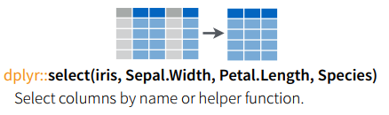
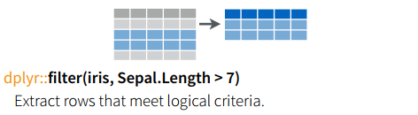
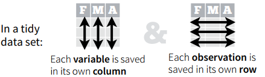
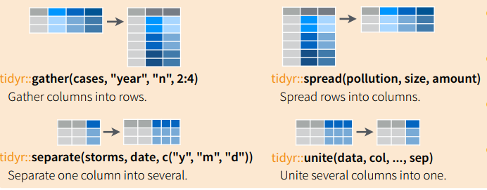

***

### Agenda 

+ Paquetes del mundo de Hadley Wickham
+ Operaciones en vectores
+ Verbos de dplyr
  + select
  + filter
  + group by
  + summarise
  + mutate
  + arrange
+ *tidyr*
+ Tarea
+ Tutoriales
+ Referencias

*** 

### Paquetes para manipulación y limpieza de datos

+ Manipuación de fechas [lubridate](https://cran.r-project.org/web/packages/lubridate/vignettes/lubridate.html)
+ Limpieza de datos [tidyr](https://blog.rstudio.org/2014/07/22/introducing-tidyr/)
+ Manipulacion de datos [dplyr](https://cran.rstudio.com/web/packages/dplyr/vignettes/introduction.html) 
+ Pipes de instrucciones [magrittr](https://github.com/tidyverse/magrittr)

*** 
```{r echo=T, warning=F, error=F, message=F}
library(dplyr)
library(tidyr)
library(lubridate)
library(readr)
library(knitr)
library(stringr)
```

### Operaciones vectoriales 

+ sumas, multiplicaciones, divisiones

```{r echo=T, warning=FALSE, error=FALSE, message=FALSE}
a <- c(13.5,12.1,7.5,9.3,100.2)
b <- c(1.5,2,3.8,9.2,11)

#suma
a + b
#multiplicacion
a * b 
#division
a / b

#generamos una secuencia del 1:10
x <- 1:10
#creamos una matriz ... los valores los pone por columna
z <- matrix(x, nrow=5)
z

#creamos una matriz ... los valores lso pone por renglon
y <- matrix(x, nrow=2, byrow=T)
y

#multiplicacion de matrices
y %*% z

```

+ ifelse vs if, else

`if,else` verifica elemento por elemento del vector, `ifelse` hace la comparación de todos los elementos del vector en un solo paso

```{r echo=T, warning=T, message=F, error=F}
df <- data.frame(var1=c("hola","adios","hola","adios","adios"),
                 var2=c(15,9,11,23,2))

if(df$var1 == 'hola'){
  print('hi')
} else {
  print('bye')
}

df$var3 <- ifelse(df$var1=="hola",1,0)
df
```

+ And's y Or's `&`, `|`

Tabla de verdad AND los dos 1 
```{r echo=F}
and_table_truth <- data.frame(x=c(0,0,1,1),
                              y=c(0,1,0,1),
                              AND=c(0,0,0,1))

kable(and_table_truth)
```

```{r echo=T, warning=F, message=F, error=F}
#and logico vectorial
x <- c(0,0,1,1)
y <- c(0,1,0,1)

x & y

#and logico elemento por elemento
x && y
```

Tabla de verdad de OR (al menos un 1)

```{r echo=F, warning=F, message=F, error=F}
or_table_truth <- data.frame(x=c(0,0,1,1),
                              y=c(0,1,0,1),
                              AND=c(0,1,1,1))

kable(or_table_truth)
```

```{r echo=T, warning=F, message=F, error=F}
#or logico vectorial
x | y

#or logico elemento por elemento, solo revisa el primer elemento! 
x || y 
```

 Normalmente querrás ocupar `&` y `|` para hacer las operaciones vectoriales

+ repeticiones

```{r echo=T, warning=F, message=F, error=F}
f <- c(rep(5, 4), 2, rep(2, 5))
f
```

+ generar aleatorios

```{r echo=T, warning=F, message=F, error=F}
set.seed(170271)

#de distribucion uniforme
aleatorios_uniformes <- runif(15, min=0, max=10)
aleatorios_uniformes

#de distribucion normal
aleatorios_normales <- rnorm(15, mean=0, sd=1)
aleatorios_normales

#de distribucion binomial 
#tamaño de conjunto, numero de elementos, probabilidad de exito
aleatorios_binomial <- rbinom(15, 1, 0.6)
aleatorios_binomial

#aleatorios enteros
sample(1:10, size=5, replace=T)

#aleatorios enteros
sample(1:10, size=5, replace=F)
```

+ sapply, lapply, mapply, apply

Estas funciones nos permiten aplicar operaciones propias u otras funciones a los elementos de un data frame. **sapply** regresará la respuesta de haber aplicado una o más funciones como una lista —al objeto más eficiente que el identifique—, **lapply** regresará siempre una lista, **mapply** regresará una matriz, y **apply** hay que especificarle si le queremos enviar las columnas del data frame o los renglones del data frame puede regresar un vector, arreglo o lista.

Al utilizar estos métodos se evita el uso de for... en R son muy poco óptimos —recordemos que no es un lenguaje de uso general—

```{r echo=T, warning=F, message=F, error=F}
breast_cancer <- read_csv("~/Documents/itam/mineria_datos_licenciatura/data/breast_cancer.csv")
names(breast_cancer)
#cambiemos los nombres que no tienen guion bajo! verifica la documentacion de str_replace y str_replace_all
names(breast_cancer) <- str_replace_all(names(breast_cancer), " ", "_")
names(breast_cancer)
#uso de grep
names(breast_cancer)[grep("radius_se$", names(breast_cancer))] <- "radius_se_test"
names(breast_cancer)
names(breast_cancer)[grep("test", names(breast_cancer))] <- "radius_se"
names(breast_cancer)


nulos <- sapply(breast_cancer, function(x) sum(is.na(x)))
nulos

#funcion para calcular la moda
mode_calc <- function(x){
  table(x) %>% 
    which.max() %>%
    names()
}

modes <- sapply(breast_cancer, function(x) mode_calc(x))
modes
```

### dplyr

dplyr permite manipular los datos como los utilizarias ocupando sql. Los verbos de dplyr son: select, filter, group_by, summarise, mutate, arrange, join.

Supón que queremos obtener del set de datos de cáncer de mama cuántas observaciones hay por tipo de tumor. En sql sería:

`select diagnosis, count(*)
from breast_cancer
group by diagnosis`

En dplyr *select* se ocupa como en sql para seleccionar las columnas que queremos que formen parte de la respuesta, *group_by* hace lo mismo que en sql agrupa un set de datos por alguna columna(s), el from de sql corresponde a indicar el data frame en donde realizaremos la consulta, count(\*) forma parte de una agregación, esto es... por cada grupo encontrado regresará **1 y solo 1 número asociado...** compacta un set de datos a un solo renglón, para hacer esta agregación en dplyr ocupamos *summarise* en donde indicamos qué operación queremos hacer para la agregación, count(\*) es un `n()` en dplyr, también se puede sacar `mean()`, `sd()`, `median()`, una función definida por nosotros, etc. Para unir todas las funciones ocupamos *magrittr* `%>%` -si vienes del mundo de unix este operador es el pipe! `|`-.



```{r echo=T, warning=F, error=F, message=F}
grupos_tumores <- breast_cancer %>% group_by(diagnosis) %>%
  summarise(count=n())

grupos_tumores

```

La salida de `group by` regresa las cosas ordenadas alfabéticamente -por la columna con la que hizo agruapción-, si quisieramos arreglar la salida por tamaño del grupo de mayor a menor, en sql sería:

`select diagnosis, count(*)
from breast_cancer
group by diagnosis
order by count(*) desc`

En dplyr ocupamos *arrange*, por default se ordenand de manera ascendente por lo que debemos indicar que lo queremos de manera descendiente y por cuál columna vamos a ordenar

```{r echo=T, warning=F, error=F, message=F}
grupos_tumores <- breast_cancer %>% group_by(diagnosis) %>%
  summarise(count=n()) %>% arrange(desc(count))

grupos_tumores
```

La función *mutate* permite agregar una columna que no existía en el data frame original ocupando columnas que se hayan generado a través de summarise 

```{r echo=T, warning=F, error=F, message=F}
grupos_tumores <- breast_cancer %>% group_by(diagnosis) %>%
  summarise(count=n()) %>% 
  mutate(prop=count/sum(count)) %>%
  arrange(desc(prop))

grupos_tumores
```

Esto también se pudo haber hecho con el método *prop.table* ... es parte de lo bonito de R, una misma cosa se puede hacer de muchas maneras diferentes :)
```{r echo=T, warning=F, error=F, message=F}
#revisa la documentacion de table y prop.table! te servirán en el curso
alternativa <- prop.table(table(breast_cancer$diagnosis))
alternativa
```

La función *filter* permite filtrar un data frame por alguna conidicion(es) que los renglones deban cumplir, por ejemplo: si quisieramos obtener las observaciones que corresponden a tumores benignos, en sql sería: 



`select * 
from breast_cancer
where diaganosis = 'B' `

En dplyr sería:

```{r echo=T, warning=F, error=F, message=F}
breast_cancer %>% filter(diagnosis == "B")
```

 Nota el uso de doble igual `==` porque es una condición lógica a probar

Se puede hacer *filter* por más de una condición a la vez, por ejemplo: si quisieramos obtener los tumores que son beningnos y un radio promedio mayor o igual a 15, en sql sería: 

`select *
from breast_cancer
where diagnosis == 'B'
and radius_mean >= 15
`

```{r echo=T, warning=F, error=F, message=F}
#las observaciones de tumoers que sean benignos y con radio mayor igual a 15
subset <- breast_cancer %>% filter(diagnosis == "B", radius_mean >= 15)
dim(subset)

head(subset)
```


Para hacer joins como en sql, supongamos que tenemos la tabla empleados y la tabla departamentos 
```{r echo=F, warning=F, error=F, message=F}
empleados <- data.frame(nombre=c("Juan","Jose","Jesus"),
                        departamento=c("TI","Ventas","TI"),
                        antiguedad=c(3,4,5))

empleados

departamentos <- data.frame(depto=c("TI","Ventas","Legal"),
                           empleados=c(20,20,20))

departamentos
```

Aprovechemos para ver `%in%`

```{r echo=T, warning=F, message=F, error=F}
departamentos %>% filter(depto %in% c("TI","Legal"))
```


Para hacer un inner join —que esten en ambas tablas— entre empleados y departamento en sql sería: 

`select *
from empleados e
inner join departamentos d
on e.departamento = d.depto
`

En dplyr sería: 

```{r echo=T, warning=F, error=F, message=F}
inner_join(empleados, departamentos, 
           by=c("departamento"="depto"))
```

Para hacer un left join —todas las observaciones que aparezcan en la tabla izquierda, aunque no estén en la de la derecha— en sql sería: 

`select *
from departamentos d
left join empleados e
on d.depto = e.departamento `

En dplyr sería: 

```{r echo=T, warning=F, error=F, message=F}
left_join(departamentos, empleados,
           by=c("depto"="departamento"))
```

 dplyr es muy ocupado porque permite hacer conexiones a bases de datos relacionales: postgreSQL, MySQL, BigQuery y ahora también a Spark o(〃＾▽＾〃)o con ayuda de la librería sparklyr, esto permite que hagamos operaciones de SQL **en** la base de datos pero ocupando lenguaje de dplyr (los verbos)... permite hacer window functions... such an amazing thing :)


Conexión a postgres, se requiere el paquete RPostgreSQL: 

```{r echo=T, warning=FALSE, error=FALSE, message=FALSE}
library(RPostgreSQL)

#conexion a bd
con <- src_postgres(dbname="northwind", user="lmillan", 
                    password="lmillan", host="localhost")
#tabla
orders_tbl <- tbl(con, "orders")

#cuantos paises diferentes hay?
paises <- orders_tbl %>% group_by(shipcountry) %>% 
  summarise(count=n()) %>%
  collect() #nota que se requiere un collect para regresar los datos a r!

paises
```

Pero no se regresan ordenados... ordenémoslos de manera descendente para saber cuáles son los países a los que más se han enviado órdenes

```{r echo=T, warning=F, message=F, error=F}
paises %>% arrange(desc(count))
```

#### tidyr

El paquete de tidyr se utiliza para limpiar y manipular los datos para que después puedan ser analizados con los demás paquetes estadísticos de R. Los datos limipios deben cumplir con dos cosas: 

1. Cada columna es una variable
2. Cada renglón es una observación



Cualquier representación de datos que no cumpla con estas dos características debe ser *limpiado*. Los verbos que se ocupan para limpiar los datos son *separate*, *extract*, *gather* y *spread*. 

Tenemos el siguiente data frame, tomado de [blog tidyr](https://blog.rstudio.org/2014/07/22/introducing-tidyr/):

Qué está mal?

```{r echo=TRUE, warning=FALSE, error=FALSE, message=FALSE}
messy <- data.frame(nombre=c("juan.perez.lopez","martha.lopez.benitez",
                             "jesus.ramirez.perez","jose.martinez.lopez",
                             "aurora.saldivar.salazar"),
                    genero_edad=c("m.35","f.23","m.30","m.25","f.33"),
                    time=c(1,3,4,5,6))

messy
```




Separando los nombres

```{r echo=T, warning=F, error=F, message=F}
semi_messy <- messy %>% separate(col=nombre, into=c("nombre",
                                      "apellido_paterno",
                                      "apellido_materno"), 
                   sep="\\.")

semi_messy
```

Separando genero y edad

```{r echo=T, warning=F, error=F, message=F}
clean <- semi_messy %>% separate(col=genero_edad, into=c("genero","edad"), 
                   sep="\\.")

clean
```

Otro ejemplo: ¿Qué está mal?

```{r echo=T, warning=F, error=F, message=F}
messy <- data.frame(pais=c(rep("Afganistan",4),
                           rep("Brazil",4),
                           rep("China",4)),
                    year=c(rep(1999,2),rep(2000,2),
                           rep(1999,2),rep(2000,2),
                           rep(1999,2),rep(2000,2)),
                    llave=c("casos","poblacion","casos","poblacion",
                          "casos","poblacion","casos","poblacion",
                          "casos","poblacion","casos","poblacion"),
                    valor=c(75,1300000,134,1400000,
                            10000,100000000,12000,120000000,
                            56000,150000000,60000,170000000))

messy
```

*spread* 

```{r echo=TRUE, error=FALSE, message=FALSE, warning=FALSE}
clean <- messy %>% spread(key=llave, value=valor, fill=NA)

clean
```


*gather* el inverso de spread, se ocupa mucho para ggplot ;)

```{r echo=TRUE, error=FALSE, message=FALSE, warning=FALSE}
stocks <- data_frame(
  time = as.Date('2009-01-01') + 0:9,
  X = rnorm(10, 0, 1),
  Y = rnorm(10, 0, 2),
  Z = rnorm(10, 0, 4)
)

stocks %>% gather(stock, price, -time)
```


***
### Tarea

A entregar el domingo **3 de septiembre 2017** 23:59:59 CST en el repositorio de la clase bajo tu carpeta alumnos/nombre_apellido con el titulo tarea_2.Rmd y tarea_2.html respectivamente. Por ejemplo: 

`alumnos/liliana_millan/tarea_2.Rmd`

Con los datos que se encuentran en la carpeta de la materia en *datos/Pokemon.csv* genera un reporte en RMD que incluya un pequeño análisis exploratorio de los datos incluyendo si los datos son numéricos su media, desviación estándar, promedio, mediana, primer cuantil, tercer cuantil, valor mínimo, valor máximo, cuántas observaciones totales tiene el set

Set de datos: [Pokemon](https://www.kaggle.com/abcsds/pokemon)

+ **\#** id del pokemon
+ **Name:** nombre del pokemon
+ **Type 1:** De qué tipo es el pokemon: agua, pasto, fuego, etc.
+ **Type 2:** Subtipo de pokemon
+ **Total:** La suma de las variables de hit points, attack, defense, special attack, special defence, speed; indica que tan fuerte es un pokemon
+ **HP:** hit points indica cuánto puede aguantar un pokemon en combate 
+ **Attack:** Indica cuánto ataca el pokemon en ataques normales
+ **Defense:** Indica cuánto aguanta el pokemon en ataques normales
+ **SP Atk:** Indica cuánto ataca el pokemon en ataques especiales
+ **SP Def:** Indica cuánto aguanta el pokemon en ataques especiales
+ **Speed:** Determina qué pokemon ataca primero 

**Puntos a calificar:** 

+ Se entregó el RMD y el html generado por el RMD con el código utilizado: 1
+ Cuenta con explicación de lo que se presentará en el reporte —contexto— de qué se trata el set de datos?, etc: 1.5
+ Análisis exploratorio -primera aproximación-: 2
   + Número de observaciones en el dataset
   + Nombre de las columnas
   + Promedio de aquellas variables que son numéricas
   + Desviación estándar de las variables que son numéricas (qué indica eso?)
   + Tipos diferentes de pokemones para el Type II 
   + Número de pokemones diferentes en el set de datos de acuerdo al nombre (número, no cuáles!) TIP: busca la función `unique()`
+ Ocupó al menos 5 visualizaciones: 2
+ Explicó lo que indica cada gráfica: 2 
+ ¿Cuál fue el pokemon más *fuerte*?: 1
+ ¿Cúantos tipos diferentes de pokemones existen en el set de datos de acuerdo a la variable 'Type 1': 1

Total: 10.5 

***

### Tutorial

+ [dplyr tutorial](http://genomicsclass.github.io/book/pages/dplyr_tutorial.html)

### Referencias

+ [Introducción a dplyr](https://cran.rstudio.com/web/packages/dplyr/vignettes/introduction.html)
+ [Paquete dplyr](https://cran.r-project.org/web/packages/dplyr/dplyr.pdf)
+ [Swirl courses](https://github.com/swirldev/swirl_courses#swirl-courses)
+ [Window functons](https://cran.r-project.org/web/packages/dplyr/vignettes/window-functions.html)
+ [tidyr](https://blog.rstudio.org/2014/07/22/introducing-tidyr/)
+ [Data wrangling cheat sheet](https://www.rstudio.com/wp-content/uploads/2015/02/data-wrangling-cheatsheet.pdf)
+ [Conexión a bases de datos dplyr](https://cran.r-project.org/web/packages/dplyr/vignettes/databases.html)
