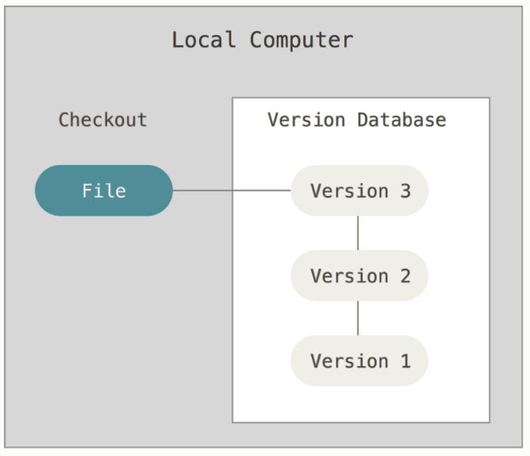
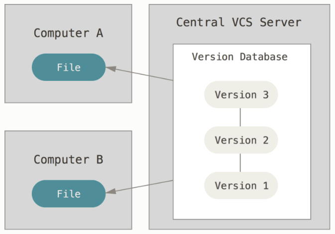
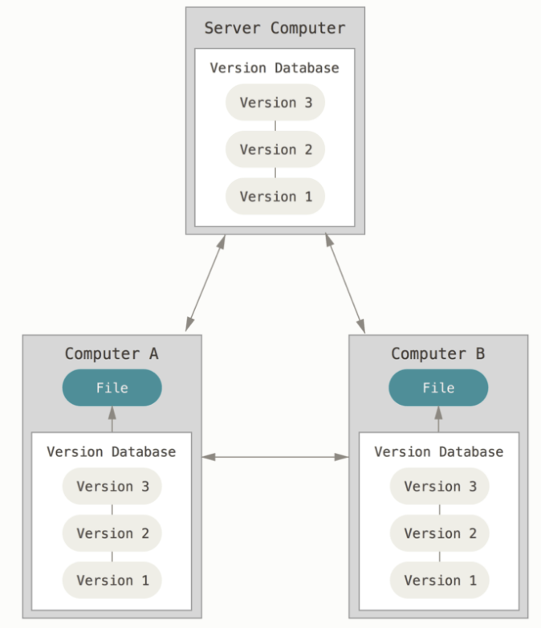
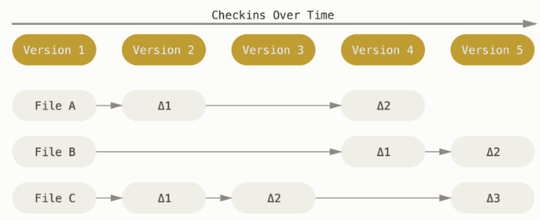
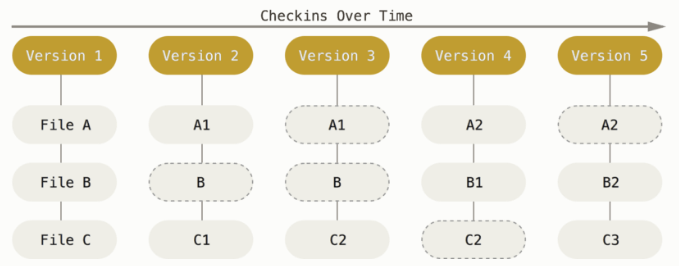
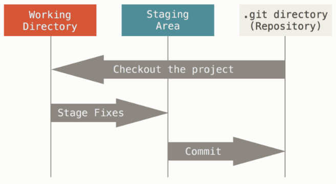
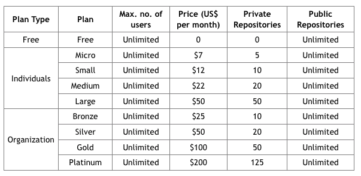
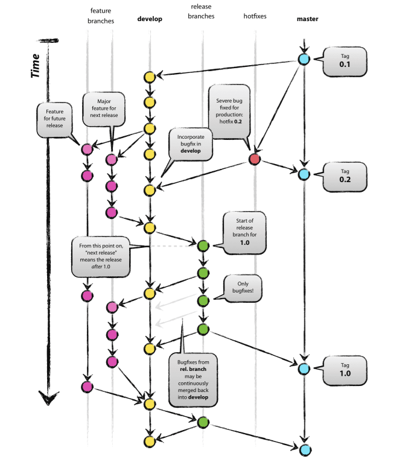
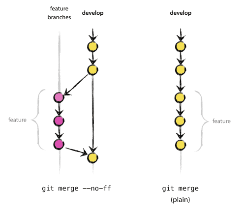

****

## Controlador de versiones 

+ ¿Qué es un controlador de versiones?
+ Tipos de controladores de versiones
+ Git
    + conceptos
    + commandos
+ GitHub y Bitbucket
+ Una buena estrategia para administración de versiones
+ Git flow
+ Tutoriales
+ Referencias

*** 

 *¿Alguien ha trabajado con CVS, SVN?*

### ¿Qué es un controlador de versiones?

**Situación:** Seguramente más de una vez durante la universidad tuviste que hacer un trabajo en equipo ... seguro tuviste que andar 
pasando por correo el avance de la presentación/trabajo/etc. 

Un sistema de control de versiones (VCS) permite administrar los cambios en archivos de manera **adecuada**, entendiedo como archivos: imágenes, documentos, código, etc. ¿Y eso qué significa? que puedes tener el histórico de los cambios que se han realizado en un archivo desde que lo subiste al sistema de versión de controles... 

 *¿Se te ocurre para qué puede ser útil esto?* 

+ permitir que más de una persona trabaje en el mismo archivo al mismo tiempo
+ integrar los cambios realizados por todos los involucrados
+ identificar quién realizó qué cambio y cuándo
+ identificar los posibles conflictos que se puedan tener
+ obtener versiones anteriores del archivo ╭(◔ ◡ ◔)/

Es natural que en un equipo de desarrollo de software se ocupe un sistema de control de versiones, pero hoy en día no es único a estos equipos, y siendo un científico de datos DEBES mantener la administración del código/documentación/papers que generas SIEMPRE! y 95% seguro que al formar parte de un equipo NECESITARÁS por el bien de todos administrar todo lo que generas.
 
***

### Tipos de control de versiones 

#### Controlador de versiones local

Es la forma más sencilla de llevar una *pequeña* administración de control de versiones. Un ejemplo de este tipo de controlador de versiones es cuando guardas en tu máquina archivos con diferentes nombres conforme vas avanzando en él... seguramente más de una vez hiciste esta aberración: 

+ proyecto_final.doc
+ proyecto_final_1.doc
+ proyecto_final_final.doc
+ proyecto_final_final_final.doc
+ ...

Varias cosas que estan mal!!! 

1. Para empezar es un doc!!! dentro de muy poco tu vida cambiará cuando empieces a ocupar markdown/Rmd/org y generarás documentos mucho más profesionales y con una presentación limpia y visualmente hermosa ... 

2. Esto solo *medio* funciona si solo tú eres el que está modificando el archivo ... en equipos esto no funciona

2. ¿Qué pasa si se te olvida guardar el archivo con alguna actualización? ... pierdes pequeños/grandes cambios realizados

3. ¿Qué pasa si le pones el mismo nombre? ... pierdes todo el historial, si te equivocaste al final no hay como regresar a una versión anterior

4. ¿Qué pasa si un día tu compu ya no prende?

Uno de las herramientas con este sistema de control de versiones es RCS (MAC tiene instalado rcs!). RCS guarda en una base de datos local pequeños parches del archivo original donde almacena solo las diferencias, puede volver a recrear un archivo al juntar todos los parches guardados.

$\rightarrow$ No ocupes este sistema de control de versiones!!!!

\*Imágenes tomadas de [Getting Started About Version Control](https://git-scm.com/book/en/v2/Getting-Started-About-Version-Control)

#### Controlador de versiones centralizado

Esta solución era la más popular y **estándar** hace algunos ayeres ... CVS y Subversion pertenecen a este tipo de controlador de versiones. 

En esta solución existe un solo servidor que tiene las versiones de los archivos y muchos clientes que se contectan a este servidor para bajar, subir o actualizar cambios a los archivos administrados en él. Claramente esta configuración server-client resuelve varios de los problemas identificados en la versión local de control de versiones: 

+ Permite a varias personas trabajar en un mismo archivo al mismo tiempo
+ Es fácil saber quién está trabajando en qué archivo, quién hizo el último cambio
+ Es más sencillo administrar y dar mantenimiento a un solo servidor que a todas las bases de datos de clientes locales

El problema de esta solución es que hay un punto de falla ... el servidor central, sin servidor no hay administración de versiones, ni versiones por lo que si le llegaba a pasar algo al servidor central ... MIEDO! Por ejemplo: si por alguna razón el servidor se caía una hora, el equipo no puede subir actualizaciones, o bajar archivos para trabajar. No está por demás mencionar que es buena práctica generar un respaldo de lo que contiene el server para evitar perder toda la historia y poder recuperar información en caso de algún problema.

\*Imágenes tomadas de [Getting Started About Version Control](https://git-scm.com/book/en/v2/Getting-Started-About-Version-Control)

#### Controlador de versiones distribuido

En este tipo de administración de control de versiones no hay como tal un servidor central, todos los *clientes* tienen una copia del repositorio **completa** localmente, esto resuelve el problema de que si el servidor central se cae -aunque aquí no hay servidor central-, tu puedes seguir trabajando. Por otro lado, si el *servidor* de alguno de los clientes se muere y estaba colaborando en alguno de los repositorios... es posible que algún otro cliente pueda regresar lo perdido al servidor ya que todos tienen una copia local completa. 

Esta es la manera en la que Git, Mercurial, Bazaar y otros de los administradores de versiones más actuales funcionan, y es por mucho la forma más utilizada actualmente de administración de control de versiones.

Solo por no dejarlo en el implícito ... puedes trabajar en más de un proyecto al mismo tiempo teniendo muchos repositorios locales en tu máquina sin entrar en ningún conflicto.

\*Imágenes tomadas de [Getting Started About Version Control](https://git-scm.com/book/en/v2/Getting-Started-About-Version-Control)

*** 

### Git

Git es un sistema de administración de control de versiones opensource, creado por Linus Torvalds -creador de Linux- en 2005, basado en BitKeeper -un sistema de administración de control de versiones utilizado en el equipo de desarrollo de Linux de 1991:2002-.

 En las referencias viene la liga a cómo instalar git en tu sistema operativo.

 En las referencias viene la liga a cómo configurar git en tu sistema operativo.

#### ¿Cómo funciona Git?

La mayoría de los controladores de versiones piensan en los datos que administran como archivos con cambios realizados -deltas- a través del tiempo, tienen una lista por archivo con los cambios realizados.

\* Imagen obtenida de [https://git-scm.com/book/en/v2/Getting-Started-Git-Basics](https://git-scm.com/book/en/v2/Getting-Started-Git-Basics)

Git piensa los datos como un flujo de snapshots. 

En git se guardan snapshots -fotografías- del estado completo de un sistema de archivos -repositorio-, cada vez que guardamos los cambios git guarda como snapshot el estado de como se ven todos los archivos localmene del repositorio en el que te encuentras trabajando y guarda una referencia a ese snapshot; si un archivo no cambió en el momento de tomar el snapshot git no guarda el archivo de nuevo, solo deja una referencia al archivo original (la liga al snapshot que guarda ese archivo...seguro alguna vez cambio o alguna vez fue creado). 

\* Imagen obtenida de [https://git-scm.com/book/en/v2/Getting-Started-Git-Basics](https://git-scm.com/book/en/v2/Getting-Started-Git-Basics)

**Características de Git**

+ **Velocidad:** Al tener una copia completa del repositorio remoto en tu máquina local, todos los cambios que realizan se guardan localmente, lo que hace que cualquier cambio realizado y registrado sea muy rápido, en los VCS tradicionales los cambios se hacen a una repositorio remoto por lo que mandar los cambios requieren de tener una conexión a internet y eso ya implica una latencia.

Si por ejemplo quisieras saber la historia de un archivo, git tiene el historial localmente y no requiere de solicitar nada al repositorio remoto. 

+ **Offline:** Debido a que la copia es local NO necesitas estar conectado a internet para seguir avanzando en lo que estes trabajando y guardar los cambios localmente para que después teniendo una conexión los subas al repositorio remoto.

+ **Integridad:** Cada cambio realizado en git tiene asociado un *check sum* generado con un SHA-1 (hash de 40 caracteres hexadecimales) por lo que siempre se utiliza este *check sum* para referenciar cambios/archivos, no puede haber forma de hacer un cambio sin que Git este enterado del mismo y lo haya registrado. Esta característica permite que no existan archivos corruptos o cambios que se pierdan en tránsito. 

+ **Guardado:** Cada vez que guardas un cambio en Git se genera el hash por cada archivo cambiado en el snapshot y el hash asociado es guardado en una base de datos. Es por este hash que es MUY DIFICIL que haya cosas que no puedas regresar en Git después de cajetearla en algo, eso brinda más flexibilidad a los miembros de un equipo de desarrollo pues las probabilidades de que algo que hagan sea terrible y no se pueda recuperar/eliminar son muy bajas. 

**Estados**

En Git los archivos pueden estar en 3 estados (principalmente)

1. **Commited:** Los cambios realizados localmente están almacenados **localmente** en la base de datos de git.

2. **Modified:** Los cambios realizados localmente son identificados por git pero aún NO han sido guardados en la base de datos local de git por lo que pueden perderse.

3. **Staged:** Archivos que modificaste localmente y que le haz hecho saber a git que los guarde en la base de datos local y formaran parte del snapshot actual -el que subirás a repositorio remoto-.

Estos 3 estados provocan que en un proyecto de git haya 3 secciones: 

\* Imagen tomada de [https://git-scm.com/book/en/v2/Getting-Started-Git-Basics](https://git-scm.com/book/en/v2/Getting-Started-Git-Basics)

**Workflow**

1. Modificas archivos en tu *working directory*
2. Pones estos archivos cambiados en stage para enterar a Git de los cambios que formarán parte del siguiente snapshot
3. Haces commit para que git haga el snapshot del estado actual y registre los cambios en la base de datos y git sepa que cosas debe subir en tu siguiente registro de cambios al repositorio remoto

**Verbos básicos** 

+ `clone`: Copiar localmente un repositorio (y todas sus ramas) `git clone <repo url>`

+ `checkout`: Cambiar de rama en el repositorio local `git checkout <nombre de branch>`

+ `pull`: Bajar los cambios remotos del repositorio en el que estoy trabajando (para tener los cambios de los demás) a mi copia local `git pull <nombre de branch>`

+ `push`: Subir mis cambios locales al repositorio remoto (para que todos los demás puedan después bajar mis cambios) `git push <nonmbre de branch>`

+ `add`: Agregar un archivo a la base de datos de git para que le haga seguimiento `git add <ruta/archivo(s)>`

+ `commit`: Guardar los cambios (snapshots) que he realizado localmente para después subirlos al repositorio remoto `git commit -m "message"`

+ `branch`: Listar las ramas que existen en el repositorio (locales y/o remotas) `git branch` ver el cheat sheet para todas las opciones

+ `merge`: En caso de conflicto entre tus cambios locales y los que existen remotamente se debe hacer un arreglo *manual* juntando los cambios locales con los que existen remotamente `git merge`. Se recomienda instalar [meld](http://meldmerge.org/) como herramienta de merge. 

 En las referencias está la liga a cómo configurar git para que ocupe meld como la herramienta de merge.

+ `stash`: Cuando tienes cambios en tu local que no quieres que se vayan en el siguiente push pero que se queden registrados en tu snapshot para después poder recuperarlos. `git stash` y después `git  stash apply` (ver que hay en stash `git stash list`)

+ `log`:  Ver el historial de cambios realizados (localmente) `git log` o de un archivo en particular `git log -p <file>`

+ `status`: Saber qué archivos han sido modificados/eliminados o qué cambios que aún no han sido regristrados (archivos nuevos) `git status`

+ `help`: Solicitar ayuda para conocer los parámetros de algún verbo `git <verbo> --help`

+ `blame`: El más lindo de todos los comandos!!! Saber quién cambio qué y cuándo (╯°□°)╯︵ ┻━┻   `git blame <file>`

 En la referencias viene la liga al *cheat sheet* de Git

### GitHub - Bitbucket

Git normalmente se utiliza a través de línea de comandos y GitHub es un website donde puedes poner tus repositorios y tener una GUI con la cuál interactuar -normalmente ocupas una combinación entre línea de comando (para administrar tus cambios locales) y la GUI para solicitar revisiones de código (Pull Request)-.

BitBucket es otro GUI (website) donde puedes poner tus repositorios de git

**Características:** 

+ GitHub y Bitbucket permiten aǹadir características al Git que facilitan la administración de repositorios en equipos de desarrollo

+ Requires una cuenta para poder utilizar GitHub y Bitbucket

+ BitBucket te permite crear repositorios públicos y privados gratuitamente pero solo permite tener 5 miembros a los más colaborando en un repo de forma gratuita.

+ GitHub te permite crear repositorios públicos gratuitamente, pero para generar repositorios privados debes pagar ($7 dolares mensuales para usuarios ;), diferente pricing para compaǹías) aquí no hay un máximo de colaboradores para un repo -público o privado-.

+ GitHub es el más ocupado en la industria, tiene alrededor de 14 millones de repositorios hosteados O.o

**Argot**

+ **Repositorio:** Donde todos los archivos correspondientes a un proyecto son almacenados, se genera una URL única por repo. Normalmente se tiene un repositorio por proyecto, pero esto puedec complicarse dependiendo de la compaǹía. Por ejemplo, imagina que trabajas en Mozilla, hay un solo producto -FireFox- pero seguro muchos desarrollos con diferenntes objetivos, ¿cómo administrarías el codigo asociado? ¿Un solo repo, y muchas ramas por objetivo -cada rama tendría que ser subdividida en master, develop y etc...-? o muchos repos uno por cada objetivo aunque sea el mismo producto?. Ejemplo. 

* **Fork:** Cuando creas un proyecto nuevo basado en un proyecto existente. Esto se hace cuando quieres agregar funcionalidad a un proyecto existente, pero no formas parte del equipo de desarrollo directamente. O bien cuando solo quieres copiar un repo para experimentar por tu lado *sin* afectar el repositorio original -que seguramente es de alguien más-. Ejemplo. 

+ **Pull Request:** Solicitar revisión de los cambios que realizaste, el objetivo es que todos cumplan un estándar de programación y que alguien que no hizo el código verifique desde un punto de vista no sesgado si la solución es correcta, eficiente y cumple con los estándares del lenguaje de programaciónn, del equipo de desarrollo y de la compaǹía; si alguno de los estándares no fue cumplido se dejan comentarios de los que revisan el código y solicitan cambios. Si todos los estándares son cumplidos el pull request es aprovado y entonces es posible cerrar el branch asociado y mergearlo a la rama de develop. 
    + Ejemplo pull request
    + Ejemplo comentarios y rechazo
    + Ejemplo aprovado
  

### Estrategia recomendada de trabajo en Git

Cuando estas en un equipo de trabajo las cosas se empiezan a complicar ya que todos están trabajando en paralelo ya sea sobre un mismo problema/proyecto o sobre diferentes partes de él. 

Para administrar correctamente los cambios y que el equipo trabaje eficientemente se recomienda seguir el siguiente modelo de trabajo en git con varios branches. 

Ramas:

+ `master`: La rama que está en producción 
+ `develop`: La rama a la que vas agregando tus cambios (preproducción) y todos los demás! 
+ branches de issues/tasks, si estas ocupando git-flow entonces:
   + `feature/issue-number`: Cuando estas agregando funcionalidad que aún no están en producción
   + `hotfix/issue-number`: Cuando arraglas un bug que existe en producción
   + `release/tag`: cuando vas a liberar cambios completos a producción

Cuando hagas merge de tu rama a la rama de develop -SOLO debes hacer merge a la rama de develop, y una vez que haz hecho Pull Request y tu Pull Request ha sido APROBADO!- hazlo con la bandera *no fast forward* `no-ff` para que quede registro de que existió tu rama y que luego la uniste a develop, sin esta bandera no queda registro de tu rama y pareciera que siempre trabajaste en develop... not cool! (git flow hace esto por ti :))

 Revisa el artículo de "Estrategia sugerida de branching" que viene en las referencias

### Git Flow 

Es una extensión de los comandos de git que permiten trabajar de manera más sencilla con flujos de trabajo en equipo con git. 

En particular facilita la creación de ramas, administrar tus cambios a la rama que creaste, al cerrar un issue/task/bug se hará cargo de subir los cambios a la rama, hacerles merge con la rama develop y borrar la rama remota (con la bandera de *no fast forward* `no-ff`)

El uso de git-flow es completamene opcional pero facilita mucho el uso de git en el día a día con equipos de trabajo

### Reglas de etiqueta en Git

+ Antes de hacer push **PRIMERO** baja todos los cambios del repositorio remoto ... -pull- de esta manera si hay conflictos los puedes resolver antes de cajetearla y dejar un desma en el remoto y se rompan las cosas!!! $\rightarrow$ recuerda que hay un comando blame!! siempre se pueden encontrar al que la cajeteo... Es una práctica común que quien rompe el repo paga las chelas! `git  pull`

+ Siempre que hagas un commit **COMÉNTALO**, esto es, agrega un comentario que indique qué demonios hiciste, cuáles son tus cambios! `git commit -m "your comment in here"`. Es práctica común que los comentarios se hacen en inglés por aquello de que es muy seguro que formes parte de equipos multidiciplinarios y multinacionales :) 

+ No es necesiario que juntes todos tus cambios (10 por ejemplo) y los subas en un solo commit, si los cambios no están muy relacionados puedes ir haciendo commits por partes para que varios archivos que tienen cambios relacionados queden registrados en un solo comentario de commit... eso le ayuda a todo el equipo a ver archivos que cambian juntos... más tarde veremos que esto sucede en automático al solicitar un **Pull Request**

+ Todos los días antes de iniciar tus cambios en el repo inicia con un git pull!!! 

+ No se te olvide agregar tus cambios a la base de datos local!!! de otra manera puedes perder tus cambios... `git add archivos_modificados.*` seguido de un `git commit -m "your comments in here"`

+ Si la cajeteaste y no sabes cómo arreglar el asunto, pide ayuda a alguien en tu equipo con más experiencia

+ Sigue el sistema de desarrollo que vimos -ramas para cada issue/task- develop y master, facilita **ENORMEMENTE** el trabajo en equipo

+ Cuando ya tienes todos los cambios que necesitas para completar un task/issue/bug/etc siempre solicita un Pull Request para que tus cambios sean revisados y aprobados ANTES de que los subas al repositorio remoto $\rightarrow$ cuando solicites el pull request toma como base la rama DEVELOP!!!! ¿por qué se te ocurre que sea tomando como base develop?

+ Cuando terminas un issue pon en el comentario de cierre de task/issue `closes #<numero de issue>` eso permitirá que git cierre automáticamente los issues asociados 

### Tarea 

A entregar máximo el domingo **27 de agosto 2017** 23:59:59 CST en el repo de la clase

+ Baja el repositorio de la materia en tu compu (clone) [https://github.com/silil/mineriaDatosITAM_agodic17](https://github.com/silil/mineriaDatosITAM_agodic17)
+ En la carpeta **alumnos** genera un Rmd/org/txt que contenga:
    + tu nombre
    + edad
    + si trabajas o no, si trabajas indica en dónde
    + carrera(s) que estas estudiando
    + semestre en el que estas
+ Una vez que creaste tu archivo guarda tu archivo a tu base de datos local (add, commit) y solicítame un pull request
+ Hasta que haya aprobado tus cambios súbelos al repositorio remoto (push)
+ Antes de hacer cualquier cosa recuerda hacer `git pull`!!!!

***

### Tutoriales

+ [Git tutorial](https://try.github.io/levels/1/challenges/1)
+ [Git tutorial - atlassian](https://www.atlassian.com/git/tutorials/comparing-workflows)

### Referencias 

+ [Estrategia sugerida de branching](http://nvie.com/posts/a-successful-git-branching-model/)
+ [Getting Started About Version Control](https://git-scm.com/book/en/v2/Getting-Started-About-Version-Control)
+ [Instalar Git en Linux/Mac/Windows](https://git-scm.com/book/en/v2/Getting-Started-Installing-Git)
+ [Configuración de git](https://git-scm.com/book/en/v2/Getting-Started-First-Time-Git-Setup)
+ [Libro Git](https://git-scm.com/book/en/v2)
+ [SHA-1](https://en.wikipedia.org/wiki/SHA-1)
+ [Git Cheat Sheet](https://www.git-tower.com/blog/git-cheat-sheet/)
+ [Git flow cheat sheet](https://danielkummer.github.io/git-flow-cheatsheet/)
+ [meld - mergetool](http://meldmerge.org/)
+ [Configuración de herramienta de merge](https://git-scm.com/docs/git-mergetool)
+ [Cómo funciona GitHub](https://github.com/features)
+ [GitHub](http://github.com)
+ [Bitbucket](http://bitbucket.org) 
